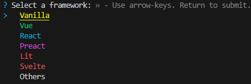
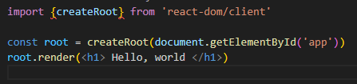
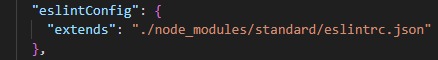

# learning-react

## Creating vanilla react project:
**Install minimum Vite and we'll configure all.
    ```
    npm create vite@latest
    ```
- Step 1: 
    
- Step 2:
**Install plugin into project folder *(cd ./name_project ...)
    ```
    npm install @vitejs/plugin-react -E
    ```
- Step 3:
** Install dependences
    ```
    npm install react react-dom -E
    ```
** react that is a library
** react-dom that has a binding with a browser
- Step 4:
** Configure vite
    
- Step 5:
** In the file main.jsx we imported 'createRoot' and we render the app, also we need change extension .js to .jsx. Remember do it in index.html too.
    
- Step 6:
Create new folder 'src' and create new files into it: App.jsx and add App component in main.jsx

## Instalar Linter Standard
Para proporcionar una guía de estilos, linter y formateador para código Javascript

- Step 1:
Install into project
```
npm install standard -D
```
- Step 2:
Add eslintConfig in package.json
    

