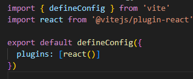

# learning-react

Instalar Standard para proporcionar una guía de estilos, linter y formateador para código Javascript
```
npm install standard -D
```

# Creating vanilla react project:
**Install minimum Vite and we'll configure all.
    ```
    npm create vite@latest
    ```
- Step 1: 
    
- Step 2:
** Install plugin into project folder *(cd ./name_project ...)
    ```
    npm install @vitejs/plugin-react -E
    ```
- Step 3:
** Install dependences
    ```
    npm install react react-dom -E
    ```
** react that is a library
** react-dom that has a binding with a browser
- Step 4:
** Configure vite
    
- Step 5:
** In the file main.jsx we imported 'createRoot' and we render the app
    


